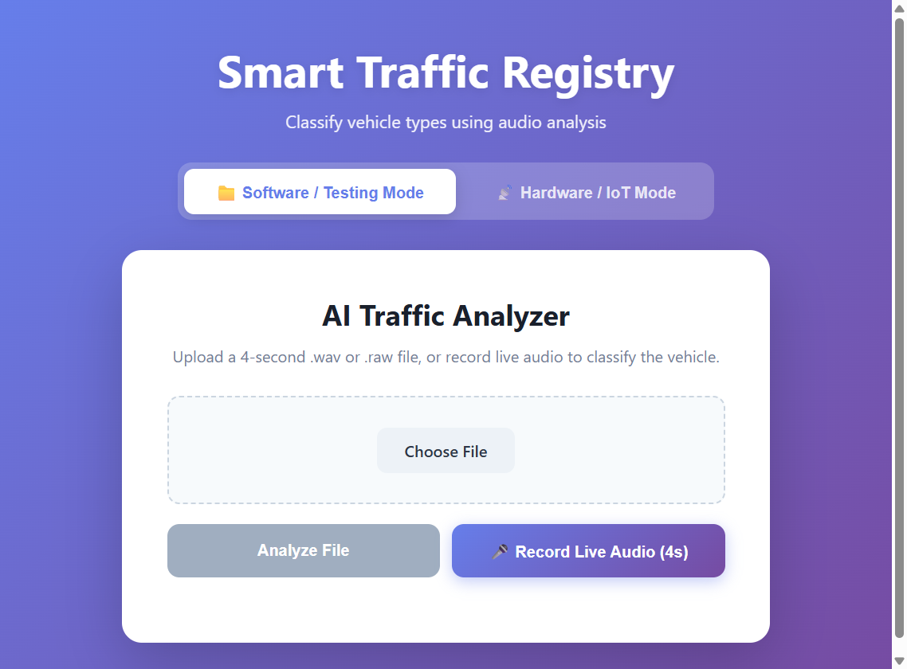

# Smart Traffic Registry

A real-time vehicle classification system using audio analysis with IoT integration. Built with Flask, React, and XGBoost.



## Table of Contents

- [Project Overview](#project-overview)
- [Features](#features)
- [Project Structure](#project-structure)
- [Tech Stack](#tech-stack)
- [Installation](#installation)
- [Usage](#usage)
- [Model Details](#model-details)
- [Data Pipeline](#data-pipeline)
- [IoT Integration](#iot-integration)
- [Contributing](#contributing)
- [License](#license)

## Project Overview

Smart Traffic Registry is a vehicle classification system that uses audio analysis to identify different types of vehicles (Car, Bus, Truck, Bike) and Background noise. The system includes both a software frontend for recording and uploading audio, as well as IoT hardware integration for real-time street monitoring.

## Features

- 🎤 **Audio Recording & Upload**: Record audio directly from your browser or upload WAV/RAW files
- 🤖 **ML Classification**: XGBoost model with 1,091-dimensional feature vector
- 📊 **Real-time Dashboard**: See predictions and confidence scores instantly
- 📱 **IoT Integration**: ESP32/ESP8266 hardware support for street-side monitoring
- 📈 **Prediction History**: View up to 50 recent predictions
- 🔊 **YAMNet Embeddings**: Google's YAMNet for powerful audio feature extraction

## Project Structure

```
traffic project/
├── backend/                # Flask backend API
│   ├── app.py             # Main Flask application
│   ├── predict.py         # Prediction logic
│   ├── model_loader.py    # Model loading utilities
│   ├── requirements.txt   # Python dependencies
│   └── uploads/           # Temporary file storage
├── frontend/              # React + Vite frontend
│   ├── src/
│   │   ├── components/    # React components
│   │   └── App.jsx        # Main app component
│   └── package.json
├── scripts/               # Data processing and training scripts
│   ├── 1_filter_data.py   # Filter AudioSet data
│   ├── 2_download_audio.py # Download audio clips
│   ├── 3_extract_features.py # Extract audio features
│   ├── 4_train_model.py   # Train XGBoost model
│   └── 5_simulate_iot.py  # Simulate IoT device
├── models/                # Trained ML models
├── processed/             # Processed data and features
├── raw_data/              # Raw audio and vibration data
├── hardware/              # IoT hardware scripts
└── results/               # Training results and visualizations
```

## Tech Stack

### Backend
- **Flask**: Web framework
- **XGBoost**: Machine learning model
- **Librosa**: Audio feature extraction
- **TensorFlow Hub**: YAMNet model
- **NumPy, Pandas**: Data processing

### Frontend
- **React 19**: UI framework
- **Vite**: Build tool
- **ESLint**: Code linting

### ML Models
- **YAMNet**: Google's pre-trained audio event classifier (1024 embeddings)
- **XGBoost**: Gradient boosted decision trees for classification

## Installation

### Prerequisites
- Python 3.8+
- Node.js 18+
- Git

### Backend Setup

1. Create and activate a virtual environment:
```bash
python -m venv venv
# Windows
venv\Scripts\activate
# Linux/macOS
source venv/bin/activate
```

2. Install dependencies:
```bash
cd backend
pip install -r requirements.txt
```

### Frontend Setup

```bash
cd frontend
npm install
```

## Usage

### Running the Backend

```bash
cd backend
python app.py
```

The backend will start on `http://0.0.0.0:5000`

### Running the Frontend

```bash
cd frontend
npm run dev
```

The frontend will start on `http://localhost:5173`

### API Endpoints

- **POST /api/predict**: Upload audio file for classification
  - Accepts: `.wav` or `.raw` files
  - Optional headers: `X-Vibration-X`, `X-Vibration-Y`, `X-Vibration-Z` for IoT vibration data
  
- **GET /api/history**: Get recent prediction history (last 50 entries)

## Model Details

### Feature Vector (1,091 dimensions)

1. **YAMNet Embeddings**: 1024 features from Google's audio event classifier
2. **MFCC Features**: 52 features (13 MFCCs + mean, std, delta, delta2)
3. **Spectral Features**: 8 features (centroid, rolloff, bandwidth, ZCR, RMS, flatness)
4. **Synthetic Vibration**: 7 features (low-pass filtered rumble analysis)

### Classes
- Background
- Car
- Bus
- Truck
- Bike

### Performance
The XGBoost model achieves competitive accuracy on the test dataset. Refer to the confusion matrix and classification report in the `results/` directory.

## Data Pipeline

### Step 1: Filter Data
Filters AudioSet dataset for vehicle-related audio clips:
```bash
python scripts/1_filter_data.py
```

### Step 2: Download Audio
Downloads audio clips from YouTube:
```bash
python scripts/2_download_audio.py
```

### Step 3: Extract Features
Extracts 1,091-dimensional feature vectors with checkpointing:
```bash
python scripts/3_extract_features.py
```

### Step 4: Train Model
Trains the XGBoost classifier:
```bash
python scripts/4_train_model.py
```

### Step 5: Simulate IoT (Optional)
Simulates an IoT device sending predictions:
```bash
python scripts/5_simulate_iot.py
```

## IoT Integration

The system supports IoT hardware (ESP32/ESP8266) for street-side monitoring:

1. The IoT device captures audio and vibration data
2. Audio is converted to features on-device or sent to the server
3. Predictions are sent via HTTP POST to `/api/predict`
4. Vibration data is included in request headers: `X-Vibration-X/Y/Z`

### Hardware Scripts
- `hardware/convert_raw_to_wav.py`: Convert raw audio to WAV
- `hardware/extract_audio_features.py`: Extract audio features on IoT device
- `hardware/extract_vibration_features.py`: Process vibration sensor data

## Contributing

Contributions are welcome! Please feel free to submit a Pull Request.

## License

MIT License
